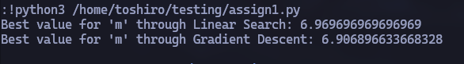
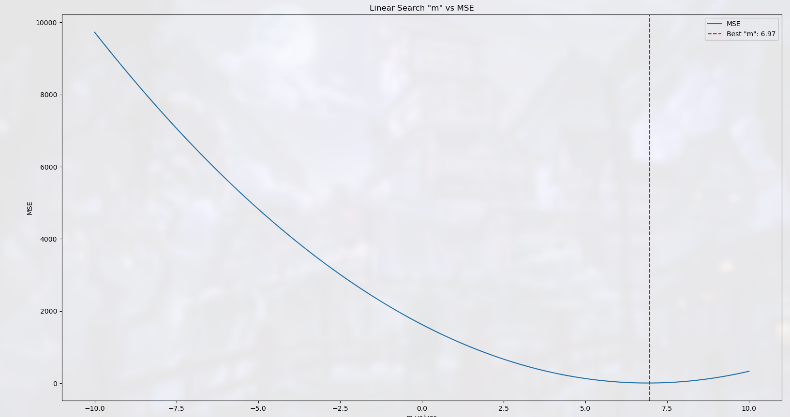
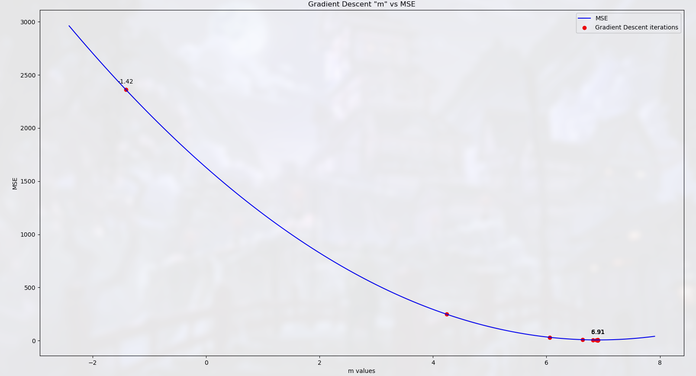

# Gradient Descent
  This repository contains a Python implementation to find the best value of "m" for a loss function L(m) using linear search and gradient descent, and visualises through linear regression

# Requirements

```
Python 3.x, NumPy 2.2.x, Matplotlib 3.10.x
```

## Installation

  You can clone the reporitory using the following command:
  ```
  git clone https://github.com/RajKalyanT/gradient-descent.git
  ```
  After successfully cloning the repository, navigate to the project directory using the following command:
  ```
  cd /gradient-descent
  ```
  To run and implement the program, use the following command:
  ```
  python3 main.py
  ```

## Equation

```
y = m1 * x + m2 + Gaussuian Noise(0,1)
```

### Actual Values

```
m1 = 6.9
m2 = 2.5
```

## Results




### Linear Search Graph



### Gradient Descent Graph

```
EPOCHS = 100
LEARNING_RATE = 0.01
```


